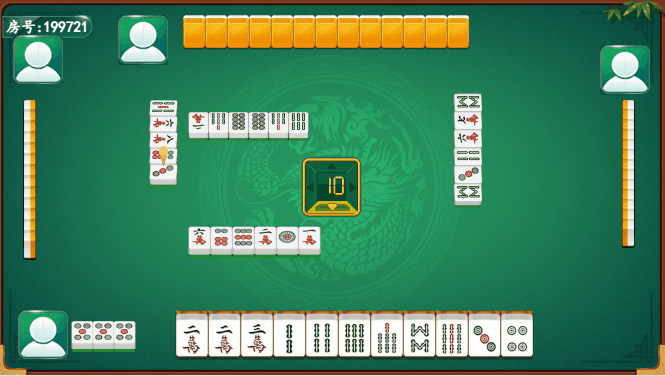

# <p align="center">使用Laya引擎开发的麻将游戏服务端</p>

## 🔥 [客户端仓库地址](https://github.com/liumengniu/majiang)
## 🔥 [直接上手？文档地址？](https://liumengniu.github.io/majiang-server/)

[//]: # (https://github.com/ikatyang/emoji-cheat-sheet 表情仓库)


## 🎞️ 项目介绍

> 使用laya3.x游戏引擎 + nodejs 开发的联网棋牌游戏。 \
> 以下是通过项目生成的原始示例，未经任何修改：
> 


## 🎨 项目结构

```
├── majiang-server         # 麻将服务端
├── core                   # 核心模块
├── migrations             # sql操作脚本
├── models                 # 表建模
├── routers                # api路由
├── services               # 游戏相关服务
├── utils                  # 工具类
├── .gitignore             # git忽略配置
├── package.json           # 依赖表
└── tsconfig.json          # ts配置文件
```

## 💡 正在开发中的内容

> 正在开发的内容 2024/9/29
>

| 蓝图                         | 完成情况       | 存在问题        |
|-----------------------------|------------|-------------|
| 1、登录注册                   | 已完成     | 暂无  |
| 2、开房/加入房间/解散房间        | 已完成     | 暂无  |
| 3、游戏全过程                  | 已完成     | 暂无  |
| 4、碰/杠/胡/流局               | 已完成     | 暂无  |
| 5、AI自动出牌                  | 已完成     | 暂无  |
| 6、胡牌/平局结算               | 已完成     | 暂无  |
| 7、掉线重新加入游戏             | 已完成     | 暂无  |
| 8、基础服务和棋牌玩法逻辑抽离     | 已完成     | 暂无  |
| 9、更详细的文档                | 开发中     | 暂无  |
| 10、扑克游戏（升级or斗地主）     | 开发中     | 暂无  |


## 🌟 Star History
<br>


[](https://api.star-history.com/svg?repos=liumengniu/majiang-server&type=Timeline)