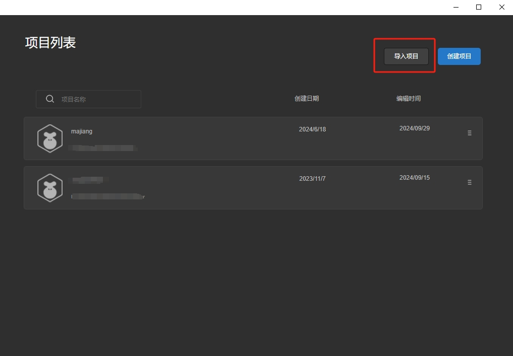
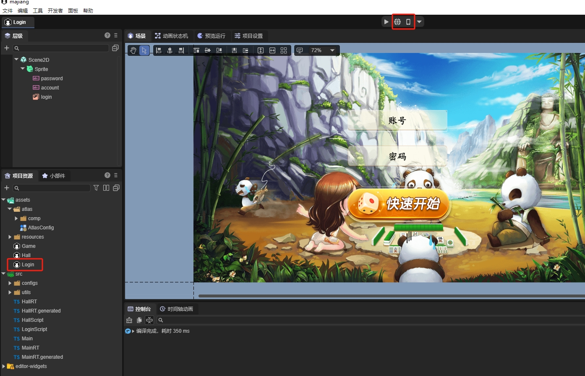

# 简介

> 基于laya引擎 + nodejs 打造了网络麻将游戏.

## 客户端启动
1. 下载laya游戏引擎，地址 [下载地址](https://www.layaair.com/#/engineDownload)
2. 导入项目 
3. 选择登录场景，启动浏览器或者手机模拟器 

## 服务端启动

1. 安装依赖
   ```
    npm i
   ```
2. 配置mysql相关配置，位于 根目录/config/config.json
3. 启动服务
  ```
    npm run start 正常启动
    npm run debug 调试模式启动，会启动nodejs的 inspect
   ```
4. 编译生产
  ```
    npm run pro 
  ```
5. pm2 操作

